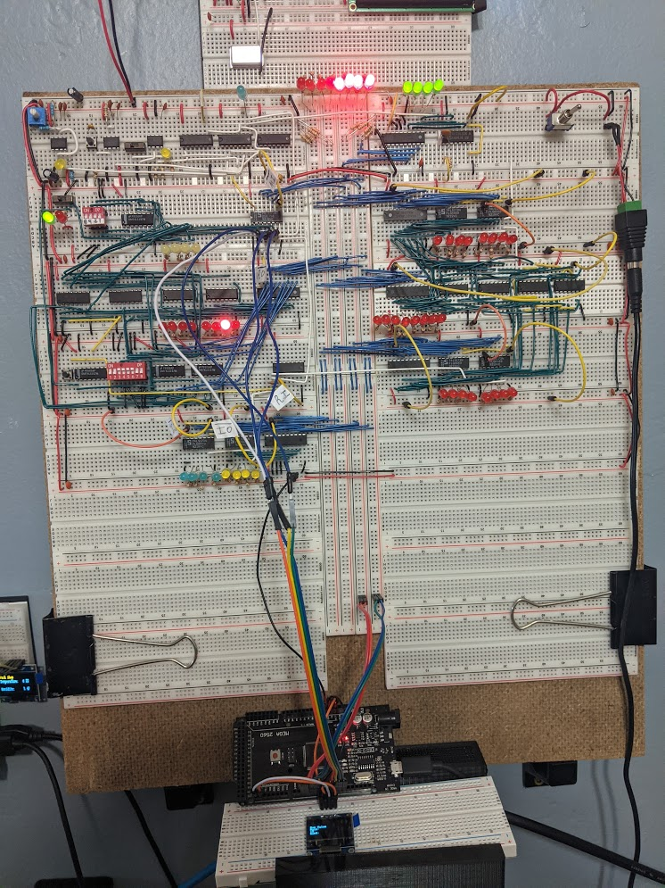
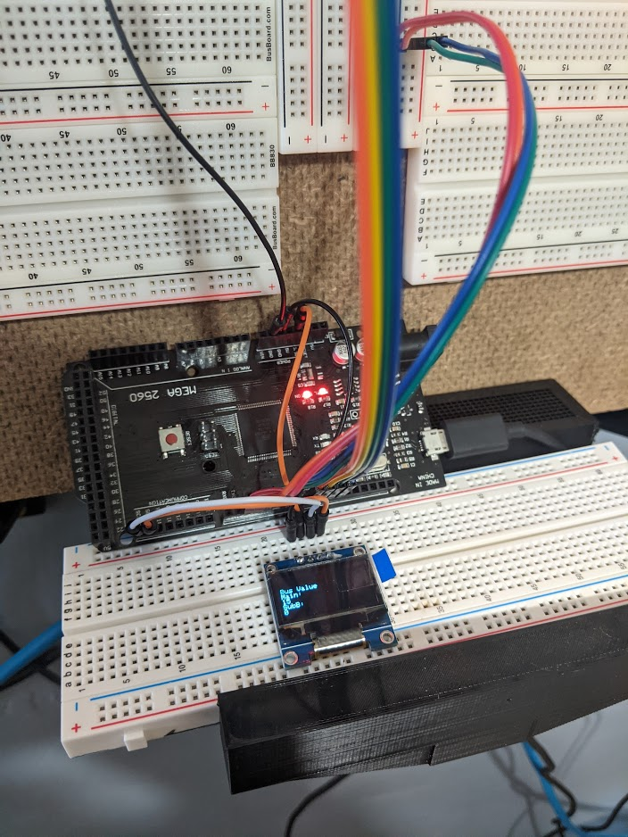

# Data Bus Analyzer
 This is an arduino mega project designed to read data from a main bus and a sub bus to make sure continuity across systems. This was inspired by a bug encountered while working on a 8-bit computer build I made with the instruction of Ben Eater's Guide at eater.net.

